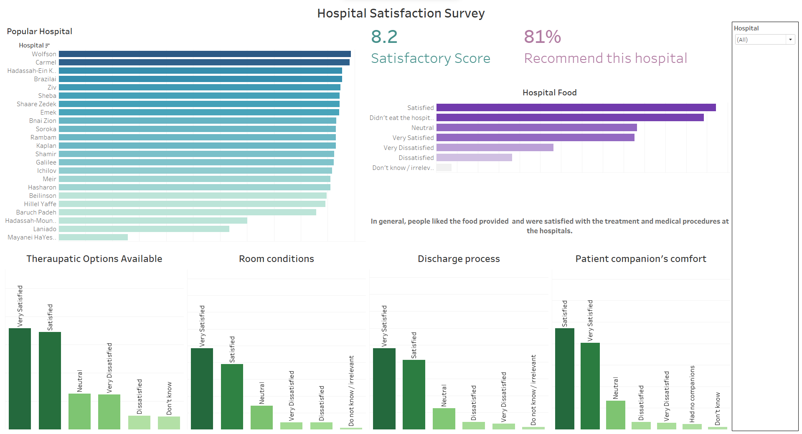

# Hospital-Satisfaction-Survey

In the following project, we analyzed survey responses from patients across several hospitals in Israel.

This analysis aimed to gain critical insights into how each hospital performed
and the overall patient experience during their visit to the respective hospitals.

****

# About Dataset

This dataset is a survey conducted at several hospitals in Israel in 2016 asking about the 
patient's visits to the hospitals, their treatments, and their experiences with several 
facilities provided by the respective hospitals.

Dataset Link: https://data.gov.il/dataset/satisfaction-hosp-general2016
(instead of the link, use the `satisfaction-hosp-general2016.xls` data initially)

### Data Transformation
(See the code for better understanding)
1. Filled the missing values.
2. Checked for unique values and did the appropriate transformation wherever needed.
3. Mapping numerical responses in the columns to their respective texts.
4. Changed column names for better understanding.
5. Mapping numerical responses for survey questions to their respective texts.
6. Dropped columns `Q3_G` and `q31_G`.

### Attribute information
Note: The attributes/column names belong to the `modified_hosp_data.xls`, not the original data. 
See the data transformation steps above.

1. `id`: Patient ID
2. `HOSPITAL`: Name of Hospital
3. `Gender`
4. `Ward`: Ward in hospital (Internal, Surgical, Other)
5. `Hospital_size` : Big, Medium, Small
6. `Emergency_Or_Elective`: Whether the hospitalization was an emergency or elective.
7. `Chronic`: Yes/No
8. `Can_Choose_Hosp`: Yes/No
9. `HEALTH_STATUS`
10. `sat_score`: Hospital Satisfaction Score (1 to 10)
11. `would_recommend`
12. `hospital_food`
13. `Language`
14. `corridor_stay`: Who accompanied the patients
15. `Recently_lived_with`: With whom was patient living with
16. `RELIGION`
17. `AGE_TODAY`
18. `KUPAT_HOLIM`: Type of insurance the patient had
19. `Hosp_Ownership`: Was it a government hospital or private hospital
20. `Q1, Q2, ...`: Survey questions

****
## Libraries Used

`numpy`, `pandas`, `seaborn`, `matplotlib`, `os`

## Dashboard
Dashboard Link: https://public.tableau.com/views/HospitalSatisfactionSurvey_16707596865740/Dashboard1?:language=en-US&:display_count=n&:origin=viz_share_link

